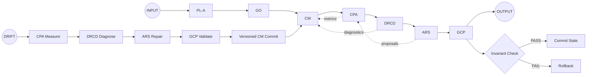

# ORP v2.7 Reference Kit

The **ORP v2.7 Reference Kit** is the canonical, immutable implementation of the **ORP v2.7 Frozen Reference Control Standard (FRCS)**. It provides a deterministic, versioned, and self-diagnosing control architecture for stochastic input processing.

---

## Canonical Architecture Diagram



---

## Status

* **Status:** Frozen / Immutable
* **Version:** 2.7.0
* **Standard:** [ORP-SPEC-2.7-CANON](https://www.google.com/search?q=docs/ORP-SPEC-2.7-CANON.md)

---

## System Identity

ORP v2.7 is a closed-loop control system. It enforces:

* **Governance Exclusivity:** The Constraint Matrix (CM) can only be mutated via the Governance Commit Protocol (GCP).
* **Deterministic Execution:** Identical inputs + identical CM version yield identical execution traces.
* **Causal Attribution:** Failure modes are identified via Drift Root Cause Decomposition (DRCD).

---

## Repository Structure

```text
├── src/orp_v2_7/       # Core executable kernel (Pipeline & Runtime)
├── golden/             # Canonical Oracle (E-01 Golden Run Trace)
├── cts/                # CTS-2.7 Enforcement Layer (Tribunal)
├── tests/              # Regression and Invariant test suites
├── docs/               # Official specification
└── scripts/            # Operational control surface
```

---

## Compliance & Verification

This implementation is **ORP v2.7-compliant** if and only if it satisfies the `CTS-2.7` verification harness.

### Running the Compliance Suite

To verify the implementation against the Canonical Golden Run (E-01):

```bash
pip install -e .
```

```bash
pytest
```

---

## Documentation

* **Specification:** [ORP-SPEC-2.7-CANON.md](https://www.google.com/search?q=docs/ORP-SPEC-2.7-CANON.md)
* **Annex A (CTS):** [ANNEX-A-CTS-2-7.md](https://www.google.com/search?q=docs/ANNEX-A-CTS-2-7.md)

---

*ORP v2.7 is a frozen epistemic artifact. Any modification to invariants, subsystem contracts, or pipeline ordering requires designation ORP v2.8 or higher.*

