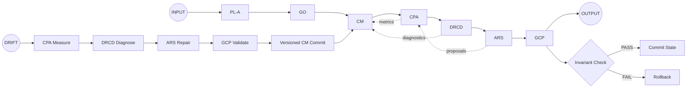

# ORP v2.7 Reference Kit

The **ORP v2.7 Reference Kit** is the official, immutable reference implementation of the **ORP v2.7 Frozen Reference Control Standard (FRCS)**.

It serves as a deterministic, versioned, and self-diagnosing control architecture for processing stochastic inputs under strict governance.

---

## Canonical Architecture



---

## Status

- **Status**: Frozen / Immutable
- **Version**: 2.7.0
- **Standard**: ORP-SPEC-2.7-CANON

---

## Core Principles

ORP v2.7 enforces:

- **Governance Exclusivity** — The Constraint Matrix (CM) can only be mutated through the Governance Commit Protocol (GCP).
- **Deterministic Execution** — Identical inputs + identical CM version produce identical execution traces.
- **Causal Attribution** — Failure modes are diagnosed through Drift Root Cause Decomposition (DRCD).

---

## Repository Structure

```text
├── src/orp_v2_7/          # Core executable kernel (Pipeline & Runtime)
├── golden/                # Canonical Oracle (E-01 Golden Run Trace)
├── cts/                   # CTS-2.7 Enforcement Layer (Compliance Test Suite)
├── tests/                 # Regression and invariant tests
├── docs/                  # Official specification and annexes
└── scripts/               # Operational tools
```

---

## Compliance & Verification

This implementation is **ORP v2.7 compliant** if and only if it passes the full `CTS-2.7` verification harness.

### Running the Compliance Suite

```bash
pip install -e .
pytest
```

---

## Documentation

- **Main Specification**: [docs/ORP-SPEC-2.7-CANON.md](docs/ORP-SPEC-2.7-CANON.md)
- **Annex A — CTS-2.7**: [docs/ANNEX-A-CTS-2-7.md](docs/ANNEX-A-CTS-2-7.md)

---

> **ORP v2.7** is a frozen epistemic artifact.  
> Any modification to invariants, subsystem contracts, or pipeline ordering must be released as **ORP v2.8** or higher.

---
