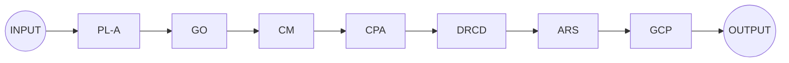
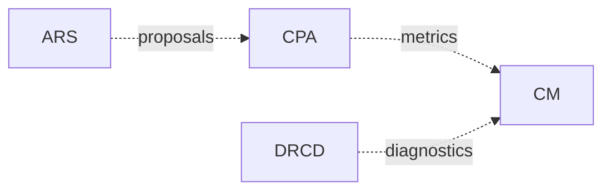
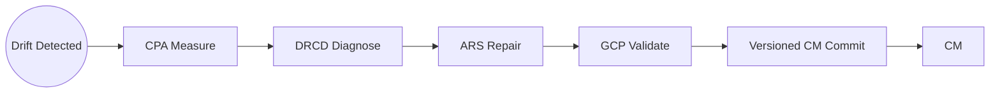
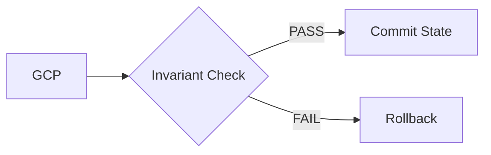

# ORP v2.7 Architecture Specification

## 1. Overview

The ORP (Operational Reasoning Pipeline) v2.7 defines a structured execution and governance system composed of:

* A deterministic execution pipeline
* A separated observability layer
* A failure recovery loop
* A governance enforcement gate

The architecture is designed around strict separation of concerns and invariant enforcement at the governance boundary.

---

## 2. Core Execution Pipeline

The execution pipeline represents the primary forward flow of system state transformation from input to output.

### Pipeline Stages

* **INPUT**: External data entry point
* **PL-A**: Preprocessing / normalization layer
* **GO**: Goal/objective formulation
* **CM**: Core memory/state representation
* **CPA**: Computational performance analysis
* **DRCD**: Diagnostic reasoning layer
* **ARS**: Adaptive repair / response synthesis
* **GCP**: Governance enforcement gate
* **OUTPUT**: Final emitted result

---

## 3. Observability & Feedback Layer

The observability layer provides non-destructive feedback signals to upstream components.

### Signal Types

* **metrics**: quantitative runtime measurements
* **diagnostics**: structural or logical fault analysis
* **proposals**: suggested improvements or adaptations

This layer does not modify execution state directly; it only informs upstream components.

---

## 4. Failure Resolution Loop

The failure loop handles drift detection and system correction without contaminating the main execution path.

### Failure Handling Stages

* **Drift Detected**: anomaly or invariant violation trigger
* **CPA Measure**: quantify deviation
* **DRCD Diagnose**: identify root cause
* **ARS Repair**: generate corrective strategy
* **GCP Validate**: enforce invariants on correction
* **Versioned CM Commit**: safe state re-injection into system memory

---

## 5. Governance Layer

The governance layer enforces system invariants and controls state transitions.

### Governance Behavior

* **Invariant Check**: validates system rules (I1, I2, I3)
* **Commit State**: authorizes transition into persistent state
* **Rollback**: halts propagation and rejects invalid state transitions

This layer acts as a hard boundary between computation and persistence.

---

## 6. Architectural Principles

### 6.1 Separation of Concerns

Each subsystem is isolated by function:

* Execution ≠ Observability ≠ Governance ≠ Recovery

### 6.2 Non-Destructive Feedback

Observability signals cannot directly mutate system state.

### 6.3 Governance Exclusivity (I1)

All state transitions must pass through GCP validation.

### 6.4 Recovery Isolation

Failure handling operates in a side-loop and reinjects only validated state.

---

## 7. System Invariants (Abstract)

* **I1: Governance Exclusivity**
  All committed states must pass GCP validation.

* **I2: Observability Non-Mutation**
  Observability signals cannot directly modify execution state.

* **I3: Recovery Containment**
  Failure recovery must not bypass governance validation.

---

## 8. Version Notes

* Version: ORP v2.7
* Status: Architectural Spec (Stable Draft)
* Compatibility: Mermaid-enabled documentation systems (GitHub, MkDocs, GitLab)

---
